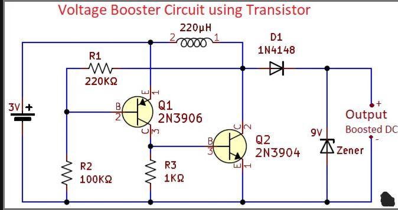

# Voltage-booster
# Voltage Booster Circuit

## Overview

A voltage booster circuit is a DC-DC converter that increases a low input voltage to a higher output voltage. In this project, the circuit converts **3V DC to 24V DC** using two transistors, an inductor, a diode, and a Zener diode for regulation.

The circuit is simple, efficient, and suitable for low-power electronic applications.

---

## Circuit Working Principle

1. The circuit operates using the inductive property of the inductor.
2. When **Q1 (2N3906)** is ON, current flows through the **220 µH inductor**, storing energy in its magnetic field.
3. When Q1 turns OFF, the inductor releases stored energy, producing a high-voltage spike.
4. This spike is rectified by **D1 (1N4148)**.
5. **Q2 (2N3904)** helps stabilize and control switching operation.
6. The **24V Zener diode** regulates and clamps the output voltage to 24V.

---

## Features

- Step-up conversion from 3V to 24V
- Simple transistor-based design
- Low cost and compact circuit
- Stable regulated output
- Easy to build on breadboard/PCB

---

## Circuit Diagram

---

## Components Required

| Component | Value |
|-----------|--------|
| Q1 | 2N3906 |
| Q2 | 2N3904 |
| L1 | 220 µH Inductor |
| D1 | 1N4148 |
| ZD1 | 24V Zener Diode |
| Supply | 3V DC |

---
## Prototype (Video Demonstration)

[▶ Watch Prototype Video](prototype-video.mp4)

---

## Applications

- Battery-powered devices
- Portable electronic systems
- Sensor circuits
- Educational electronics projects
- Low-voltage DC-DC converters
